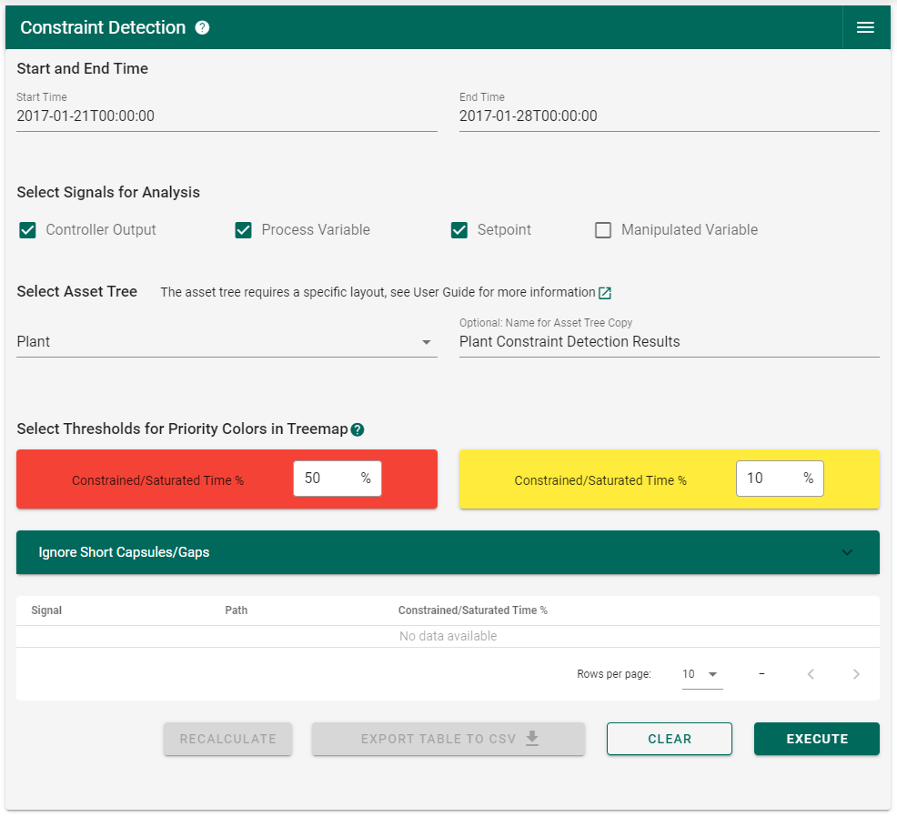
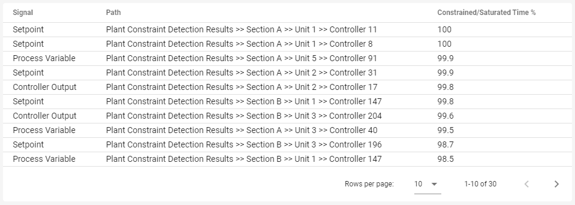
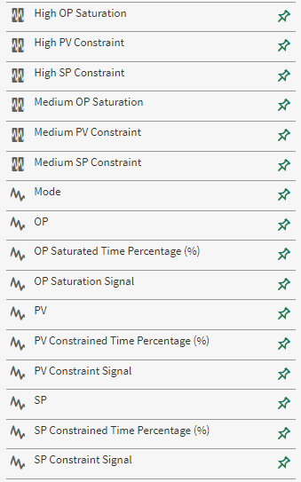
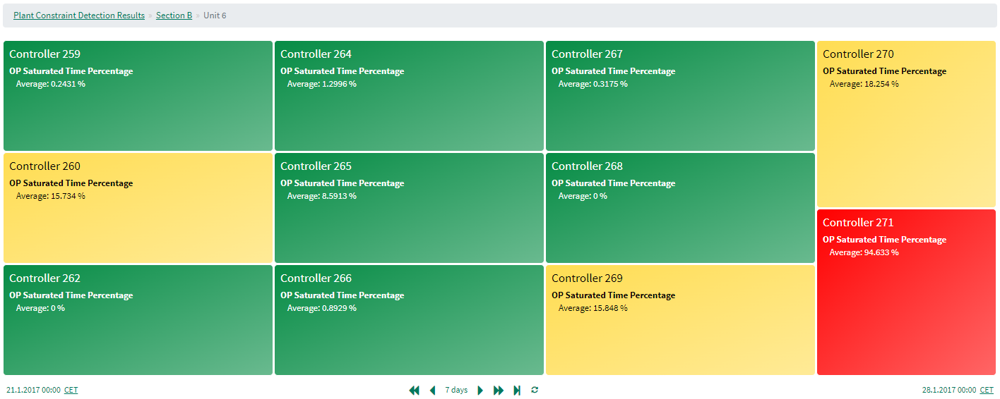
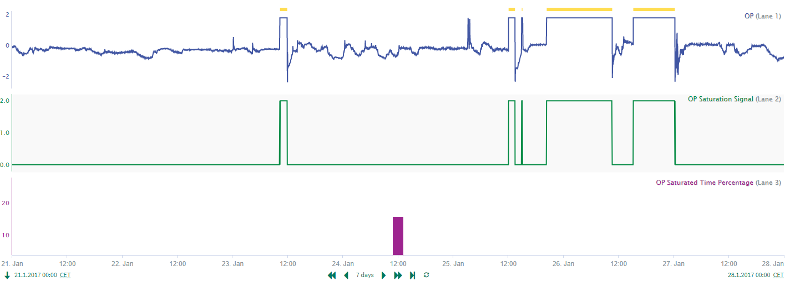
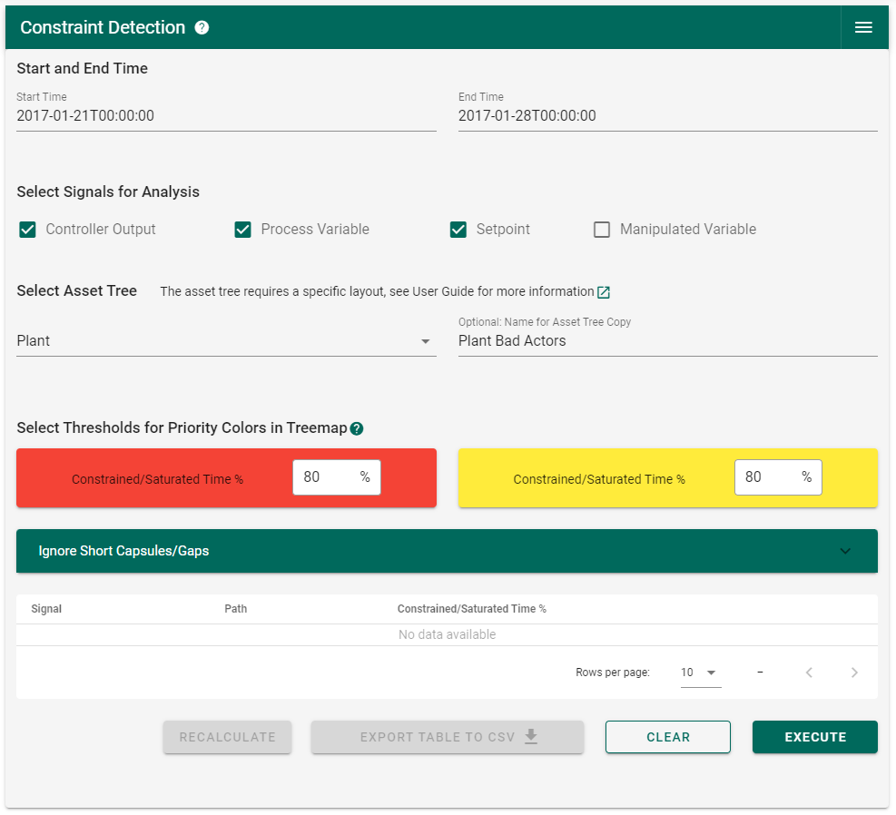
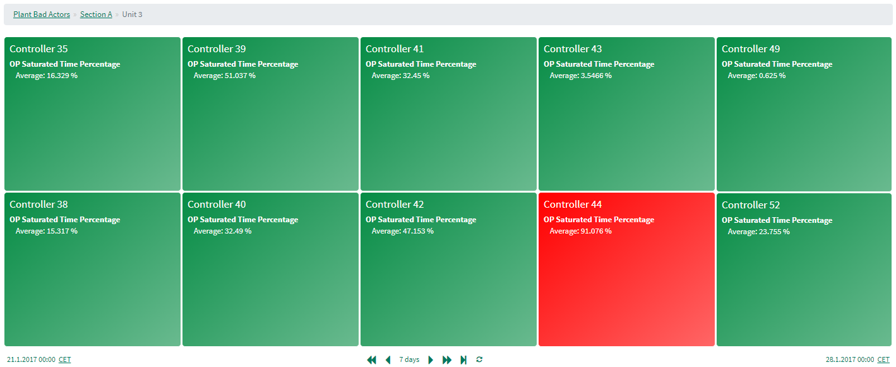
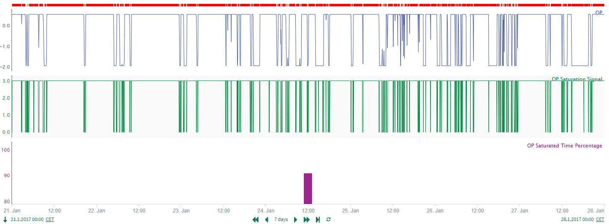

Use Cases
=========

Use Case 1: Plant-Wide Analysis of Control Loop Data
----------------------------------------------------
The **Constraint Detection Add-on** is suited for plant-wide analysis of control loop data. In this example, an asset tree with 111 controllers was analysed. Every controller has 4 signals assigned to it (Controller Output, 
Process Variable, Setpoint and Mode) which results in a total of 444 signals. The plant is divided into 2 sections where both sections have 6 units each. The structure of the asset tree and the number of controllers per unit is shown
below.

.. figure:: _static/images/asset_structure_use_case_1.PNG
   :scale: 80%
   
   Figure 1: Structure of the asset tree for use case 1

The asset tree was analysed over a period of one week and the Add-on looked for constraints/saturation in all controller outputs, process variables and setpoints. The copy of the asset tree was named "Plant Constraint Detection Results".
The thresholds were set to their default values 50% and 10%. No short capsules or gaps were specified.

   
   Figure 2: UI for use case 1

After the Add-on has finished the analysis, the table in the user interface is populated with the Top 30 of the most constrained/saturated signals in descending order. The table gives you a signal name and path, so that signals with a 
high 'Constrained/Saturated Time %' can be found easier in the treemap in the workbench. In addition, the table can be sorted by every column which gives you the option to target specific signal types or plant sections.

   
   Figure 3: Index table for use case 1

The new "Plant Constraint Detection Results" asset tree can be found in the Data panel in the workbench. For every analysed signal, there are now 2 additional signals and 2 additional conditions:

	* Analysed Signal
	* Constraint/Saturation Signal
	* Constrained/Saturated Time Percentage
	* Medium Constraint/Saturation Condition
	* High Constraint/Saturation Condition

Based on the new signals and conditions, further analysis can be executed using the tools in the workbench.

   
   Figure 4: Signals and conditions in the "Plant Constraint Detection Results" asset tree for use case 1

In the workbench, three new worksheets called "OP Saturation Detection Treemap", "PV Constraint Detection Treemap" and "SP Constraint Detection Treemap" have appeared. The treemap is coloured according to the thresholds which were set 
previously in the user interface. The 'Constrained/Saturated Time %' was selected as a statistic to be displayed in the treemap to facilitate the interpretation of the analysis results.

   
   Figure 5: OP treemap for use case 1

From the treemap, it is easy to get to the trend view by clicking on a controller panel. In trend view, the constrained/saturated periods can be investigated in more detail and underlying causes for constraints/saturation can be 
identified.

   
   Figure 6: Trendview for use case 1

Use Case 2: Identifying Bad Actors
----------------------------------
For the second use case, the asset tree from use case 1 was used again to identify bad actors. For this purpose, the thresholds for the treemap were adjusted. The red threshold and the yellow threshold were both set to 80%. 
Therefore, only red and green panels will appear in the treemap which makes it easier to find signals with a very a high 'Constrained/Saturated Time %'. This use case shows how the threshold settings in the user interface can be used 
to get a treemap visualization which is tailored to the user's requirements.

   Figure 7: UI for use case 2

The analysis was performed over a period of one week and the new asset tree was named 'Plant Bad Actors'. In the treemap, the controller outputs with a very high 'Saturated Time %' stand out and are easy to find, as can be seen below for 
controller 44 in Section A >> Unit 3.

   
   Figure 8: OP treemap for use case 2

If a bad actor is identified, the trend view for the corresponding controller can be investigated by clicking on the controller panel.

   
   Figure 9: Trendview for use case 2

.. note::
   Constraints and saturation in control signals are not always problematic because they can be an intended way of operation. For example, if controller output saturation is intended, then a signal with a high 'Saturated Time %' would 
   not be a bad actor but a good actor. See :ref:`Causes for Constraints and Saturation` for more information.

